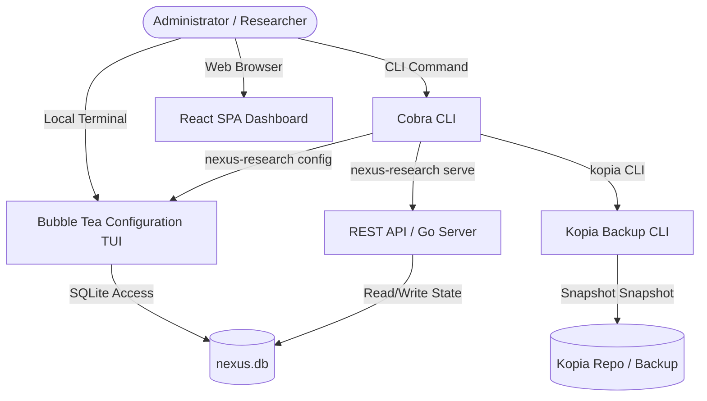

# 📋 NEXUS Research Station Workflows & Test Manual

This document details the expected core workflows for the **NEXUS Research Station** project. It combines automated verification details with step-by-step, human-readable instructions for manual verification.

---

## 🗺️ Architectural Mapping



---

## 1. TUI Configuration & User Manager
**Interface:** Terminal User Interface (TUI) powered by `bubbletea`, `huh`, and `lipgloss`.  
**Entry Point:** Run the interactive terminal interface:
```bash
./bin/nexus-research config
# Or specify a custom database:
./bin/nexus-research config --db custom.db
```

### Workflow A: General TUI Navigation
* **Goal:** Navigate the primary configuration menu and exit cleanly without causing interface locks or unhandled panic loops.
* **Test Steps:**
  1. Launch the configuration tool: `./bin/nexus-research config`
  2. Use the arrow keys (`Up` / `Down`) or vim-keys (`k` / `j`) to scroll through the menu choices.
  3. Ensure hover and focus state color changes occur cleanly.
  4. Press `q` or `Esc` to quit the application. Verify that the terminal state is fully restored.

### Workflow B: User Account Directory Search & Filtering
* **Goal:** Locate specific user profiles dynamically in large lists.
* **Test Steps:**
  1. Open the configuration TUI and select **User Management** (hit `Enter`).
  2. Press `/` to enter the filter/search mode. A query box (`🔍 █`) should render in the footer.
  3. Type a query string (e.g., `admin`). The list should filter results in real time.
  4. Press `Enter` to lock the filter. The prompt should now show `🔍 Filter: <query>`.
  5. Press `Esc` to clear the filter and display all users.
  6. Press `Esc` again to return to the main selection menu.

### Workflow C: Complete User CRUD Administration
* **Goal:** Manage local operator accounts securely, toggling administrative rights and managing password changes.
* **Test Steps:**
  1. Navigate to **User Management** and hit `Enter`.
  2. **Create User:** Press `a` (Add).
     * Input a username (e.g., `operator1`) and press `Tab`.
     * Input a password (e.g., `SecurePass123`) and press `Enter`.
     * Select whether to grant admin rights (`y` / `n`) and press `Enter` to submit.
     * Verify that `operator1` now appears in the directory.
  3. **Toggle Status:** Highlight `operator1`. Press `t` to toggle their active state. Verify that the user status displays as `disabled` and a status update toast notification is displayed.
  4. **Rename User:** Highlight `operator1`. Press `r`. Input the new name `operator_renamed` and press `Enter`. Verify that the record is renamed.
  5. **Change Password:** Highlight `operator_renamed`. Press `p`. Input a new password and press `Enter`.
  6. **Delete User:** Highlight `operator_renamed`. Press `x`. A warning confirmation screen should appear asking: *"Are you sure you want to delete...?"*. Press `y` then `Enter`. Verify that the user is deleted from the table.

### Workflow D: System Status & Environment Information
* **Goal:** Check real-time host info, uptime, and database details.
* **Test Steps:**
  1. In the main menu, navigate to **System Status** and press `Enter`.
  2. Confirm that system information displays (including the platform operating system, connection status of the SQLite database, and active configuration path).
  3. Press `Enter` or `Esc` to return to the main menu.

---

## 2. Web SPA Dashboard (Vite + React)
**Interface:** Web browser dashboard powered by `nexus-shell` workspace components.  
**Entry Point:** Start the server and navigate to the application address:
```bash
./bin/nexus-research serve --port 8080
# Open browser at http://localhost:8080
```

### Workflow A: Login Authentication & Redirection
* **Goal:** Restrict unauthorized users from viewing the Dialogue Mapper workspace.
* **Test Steps:**
  1. Open a browser and load `http://localhost:8080`. You should be redirected to the login card.
  2. Input a bad combination (e.g., username `admin`, password `wrongpassword`). Click **ESTABLISH LINK**.
     * Verify that the UI displays a warning banner stating: `invalid username or password`.
  3. Input the correct administrator credentials. Click **ESTABLISH LINK**.
     * Verify that the login card transitions out and the **Nexus Dialogue Mapper** workbench UI loads.

### Workflow B: Dialogue Mapper Workspace Interaction
* **Goal:** Interface with the interactive canvas to construct argument dialogue structures.
* **Test Steps:**
  1. Navigate to the main workbench workspace.
  2. Verify that the layout includes:
     * **IBIS Node Library** (left/top pane).
     * **React Flow Interactive Canvas** (central area).
     * **Argument Inspector Panel** (right pane).
  3. Drag an issue node from the **IBIS Node Library** and drop it onto the **React Flow Canvas**.
  4. Connect two nodes together to map a premise/argument dependency.
  5. Click on an individual node on the canvas and confirm that its parameters, details, and labels load inside the **Argument Inspector Panel**.

---

## 3. Cobra CLI Administration
**Interface:** Terminal Shell Commands.

### Workflow A: Quick-Create User
* **Goal:** Create a user account directly via the command-line interface without using the interactive TUI.
* **Test Steps:**
  1. Run the user creation command:
     ```bash
     ./bin/nexus-research user create --username operator2 --password TempPassword123 --admin
     ```
  2. Ensure the console prints: `User 'operator2' successfully created.`
  3. Verify the user exists by starting the configuration tool or running database checks.

### Workflow B: Start Web Server
* **Goal:** Serve the application at a custom port.
* **Test Steps:**
  1. Start the server on port `9090`:
     ```bash
     ./bin/nexus-research serve --port 9090
     ```
  2. Navigate to `http://localhost:9090` in your browser. Verify that the login page displays.

---

## 4. Disaster Recovery & Database Backups
**Interface:** Backup CLI & TUI.
**Requirement:** System supports both SQLite and PostgreSQL backends via multi-tenant design. Backups are stored as localized database snapshots. For PostgreSQL environments, `pg_dump` and `pg_restore` must be in the system `$PATH`.

> [!IMPORTANT]
> **Backup Storage Considerations**
> Backups are created in the `backups/` subfolder relative to execution. For enterprise disaster recovery, it is strongly advised to mount this directory to an external drive, network share, or cloud-synced storage.

### Workflow A: Automated Rolling Backups
* **Goal:** Enable the background scheduler to automatically manage backups and retention limits.
* **Test Steps:**
  1. Open the interactive TUI configuration: `./bin/nexus-research config`
  2. Select **Backup & Restore**.
  3. Press `c` to open the Backup Configuration menu.
  4. Toggle "Enable Automated Backups" to true.
  5. Configure your desired Hourly, Daily, and Monthly retention limits.
  6. Ensure the `nexus-research serve` process is running in the background. It will automatically trigger backups according to the policy every hour.

### Workflow B: Manual Backup and Restore (CLI)
* **Goal:** Use the Cobra CLI to instantly snapshot or restore the database.
* **Test Steps:**
  1. **Create Backup**:
     ```bash
     ./bin/nexus-research backup create
     ```
     Verify console log indicates success and lists the newly created `.db` or `.sql` file in `backups/`.
  2. **List Backups**:
     ```bash
     ./bin/nexus-research backup list
     ```
     Verify the console outputs a table of timestamps, sizes, and file paths.
  3. **Restore Backup**:
     ```bash
     ./bin/nexus-research backup restore backups/nexus_20260102_150405.db
     ```
     Verify the restore completes without errors.

### Workflow C: Interactive Backup Management (TUI)
* **Goal:** Graphically explore the backup inventory and execute disaster recovery operations.
* **Test Steps:**
  1. Open the interactive TUI configuration: `./bin/nexus-research config`
  2. Select **Backup & Restore** to view the inventory list.
  3. Press `b` to create a new manual backup immediately. Ensure the list updates.
  4. Press `x` to delete the highlighted backup, confirming via the prompt.
  5. Press `r` to restore the highlighted backup, carefully reading the confirmation prompt. Verify success toast message.
